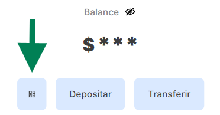
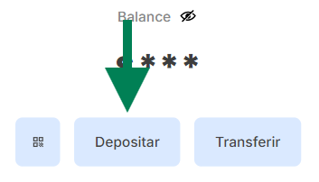
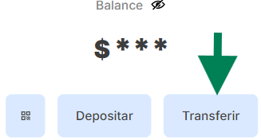

# Frontend TANGO WALLET

### Link: tangowallet.sitio

> [!CAUTION]
> Ingresar desde mobile, ya que el diseño esta hecho para este

```
-- Login / Register
                    --> Dashboard -
                                 - Read QR
                                 - Deposit    ->  Generate QR
                                                ->  Generate link
                                                ->  Account data
                                                ->  Deposit with Mercado pago
                                 - Transfer
                                                -> Only two elements are required
                                                    -> Amount
                                                    -> Wallet or Alias
```

## Read QR



> [!NOTE]
> This option allows us to scan QR codes with the camera, which are generated through `Deposit -> Generate QR`

## Deposit



> [!NOTE]
> Aquí podemos generar códigos QR y enlaces de pago, así como también ver los datos de la cuenta con su respectivo alias y wallet

### Transfer



> [!NOTE]
> In the transfer option, we can make transfers to other accounts with just two elements: the alias or wallet and the amount.

### Ejecucion

1. git clone https://github.com/tango-wallet/frontend-wallet.git
2. npm install
3. npm run dev

> This project requires an .ENV file, and the necessary variables can be found in .env.example.

> Technologies required to run it: NodeJS and NPM.

# Backend TANGO WALLET

1. We only have an endpoint that integrates all user actions such as registration and updating fields in the model

ENDPOINT

- `https://argcoupon.xyz/user`

Ejemplo: `https://argcoupon.xyz/user/info/user/:id`

2. Rutas de usuarios

   - `/login`
   - `/register`
   - `/info/user/:id`
   - `/update/address`
   - `/transfer`

3. The necesarie ENV is found in `.env.example`

### Execution

1. git [clone https://github.com/tango-wallet/frontend-wallet.git](https://github.com/tango-wallet/backend-wallet)
2. npm install
3. npm start

> Technologies required to run it: NodeJS and NPM

## Scroll Contract 

https://l1sload-blockscout.scroll.io/address/0x2b190866F036A27546C7D0918ebecEF61921E957/contracts#address-tabs

## Architecture
https://www.figma.com/board/lDtPTRQKLr0gf6RMiQ5OaS/Tango-Wallet-Estructura?node-id=208-561&t=mcqrsm5NwFraiALi-0

In further developments we will work on L1SLOAD as a sync memory for L1 L2 interoperability, with the user case of ENS.